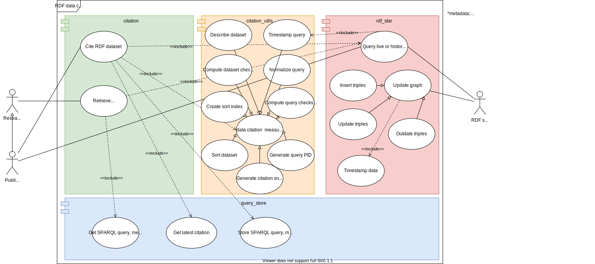

# Introduction
Citing RDF Data
Citation Utils
No need to be touched by the standard user except for the MetaData class
Explorer might want to try out functions and experiment with them

Based on Data Citation Recommendations from https://www.rd-alliance.org/system/files/documents/RDA-Guidelines_TCDL_draft.pdf
Includes important features like versioning triples with timestamps in performance or memory saving mode, normalizing 
user queries with the help of W3C's 
query algebra, computing query and dataset checksums for comparison with consecutive data citations,
generating query PIDs based on checksum and citation timestamp, Uniquely sorting the dataset by requiring an order-by clause
from the user which yields a unique sort and validating it, generating citation snippets using DataCite's mandatory attributes
Special features: Computing unique sort index for a user query, Generating a dataset description from the dataset based 
on descriptive statistics and heuristics

Citation workflow

RDF API for querying live and historic data and writing versioned to the RDF store.

Query_Store
Used by citation module, no need to be touched by the standard user
Explorer might want to delete data from the query store and use the _remove function. 

prefixes
Only to be used by the explorer. Acts as a helper class but with the focus on handling the query's prologue.

Class diagram: standard user view

Class diagram: explorer view

# UseCase diagram and modules
In the following you can see a use case to modules mapping. This diagram shows the basic use cases all the involved 
actors have but also 

# Usage
Usage for the standard user.
Parameters you need to set first.
```python 
get_endpoint = http://192.168.0.241:7200/repositories/DataCitation_FHIR
post_endpoint = http://192.168.0.241:7200/repositories/DataCitation_FHIR/statements
``` 

Make your RDF store ready for citation by initially versioning all triples. Depending on the versioning mode triples 
get either annotated with an artificial end date only or also with a start date. By default, the 
"SAVE_MEM" mode will be used and for every existing triple only one 
additional (nested) triple with the end_date as the object will be added.
In the "Q_PERF" mode the start date will be added, too, for each triple. Querying versioned data will be faster 
in return. 
```python 
rdf_engine = rdf_star.TripleStoreEngine(get_endpoint, post_endpoint)
rdf_engine.version_all_rows(versioning_mode="SAVE_MEM")
```

## Write data to triple store
Now you can use insert_triples, update_triples or outdate_triples to execute write operations against 
the RDF store and thereby modify your graph. Each of these functions will add additional metadata/nested triples to the 
RDF store and annotate the provided user triples with respective version timestamps. 
### Example for insert
```python 
prefixes = {'pub': 'http://ontology.ontotext.com/taxonomy/',
            'publishing': 'http://ontology.ontotext.com/publishing#'}

list_of_triples = 
[["<http://data.ontotext.com/publishing#Mention-dbaa4de4563be5f6b927c87e09f90461c09451296f4b52b1f80dcb6e941a5acd>",
"publishing:hasInstance",
"<http://ontology.ontotext.com/resource/tsk4wye1ftog>"],
["<http://www.reuters.com/article/2014/10/10/us-usa-california-mountains-idUSKCN0HZ0U720141010>",
"publishing:containsMention",
"<http://data.ontotext.com/publishing#Mention-dbaa4de4563be5f6b927c87e09f90461c09451296f4b52b1f80dcb6e941a5acd>"]]

rdf_engine.insert_triples(list_of_triples, prefixes)
```

### Example for update
```python
prefixes = {'pub': 'http://ontology.ontotext.com/taxonomy/'}
triples_to_update = {('<http://ontology.ontotext.com/resource/tsk4wye1ftog>',
                      'pub:memberOfPoliticalParty', 
                    '<http://ontology.ontotext.com/resource/Q76SBFD36E46-359B-445A-8EC2-A3BDDFF5E900>'):
                    '<http://ontology.ontotext.com/resource/Q201795S476DFED9-C64A-4E56-B4C3-CFB368801FBF>'}
rdf_engine.update(triples_to_update, prefixes)
```

### Example for outdate
```python 
prefixes = {'pub': 'http://ontology.ontotext.com/taxonomy/',
            'publishing': 'http://ontology.ontotext.com/publishing#'}

list_of_triples = 
[["<http://data.ontotext.com/publishing#Mention-dbaa4de4563be5f6b927c87e09f90461c09451296f4b52b1f80dcb6e941a5acd>",
"publishing:hasInstance",
"<http://ontology.ontotext.com/resource/tsk4wye1ftog>"],
["<http://www.reuters.com/article/2014/10/10/us-usa-california-mountains-idUSKCN0HZ0U720141010>",
"publishing:containsMention",
"<http://data.ontotext.com/publishing#Mention-dbaa4de4563be5f6b927c87e09f90461c09451296f4b52b1f80dcb6e941a5acd>"]]

rdf_engine.outdate_triples(list_of_triples, prefixes)
```
## Read data from triple store
If you are offering an interface, be it graphical or a console, to query data 
and display the result like we know it from database management tools, you can use the function get_data.
To see the result set is a step you certainly want to do before citing your day. Either use 
get_data combined with your own interface or an existing "graph database management tool", such as GraphDB, to do so.
```python 
rdf_engine.get_data(select_statement)
```
If for any reasons you need to query data as it was at a specific point in time you can simply pass a timestamp 
to the very same function. However, this should not be confused with the use case "retrieve cited data" (see below). 
In fact, this function will retrieve historical data, no matter if cited or not.
```python 
rdf_engine.get_data(select_statement, timestamp)
```
## Cite data
To cite your dataset and make it persistently identifiable and retrievable we first provide all necessary citation data
optionally including a result set description and the query to cite. Then we use a simple function call to cite 
the dataset. 
```python   
citation_metadata = citation_utils.MetaData(identifier="DOI_to_landing_page", creator="Filip Kovacevic",
                                            title="Judy Chu occurences", publisher="Filip Kovacevic",
                                            publication_year="2021", resource_type="Dataset/RDF data",
                                            other_citation_data={"Contributor": "Tomasz Miksa"})
result_set_description = "All news articles where Obama has been mentioned."
query_test = 
"""
PREFIX pub: <http://ontology.ontotext.com/taxonomy/>
PREFIX publishing: <http://ontology.ontotext.com/publishing#>

select ?personLabel ?party_label ?document ?mention where {
    ?mention publishing:hasInstance ?person .
    ?document publishing:containsMention ?mention .
    ?person pub:memberOfPoliticalParty ?party .
    ?person pub:preferredLabel ?personLabel .
    ?party pub:hasValue ?value .
    ?value pub:preferredLabel ?party_label .
    filter(?personLabel = "Barack Obama"@en)
}
"""
citation_data = citation.cite(query_text, citation_metadata, result_set_description)

```
The parameters in citation_utils.Metadata are all optional, but recommended by DataCite and us :). If you do not provide 
any dataset description a description will be derived from the dataset which encompasses basic descriptive 
statistics and possibly additional natural language sentences if certain heuristics 
(see citation_utils.RDFDataSetUtils.describe) are met. By executing citation.cite(...) a citation snippet 
will be generated and stored within MetaData object (see above).
```python
citation_snippet = citation_data.citation_metadata.citation_snippet
```

## Retrieve cited data
To get a cited dataset and all its associated metadata 
(query data, dataset metadata, citation and provenance metadata) and citation snippet by its query PID 
we execute following code snippet.
```python
query_pid = citation_data.query_utils.pid
query_data, result_set_data, meta_data = citation.retrieve(query_pid)
dataset = result_set_data.dataset
```
These data can now be display on a human-readable landing page.