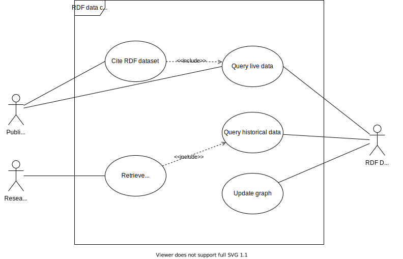
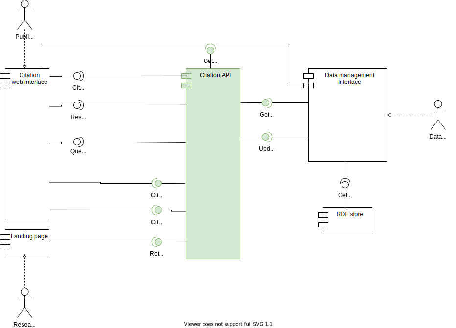

# Introduction
This wiki assumes that you are familiar with following domains:  
Triple stores or RDF stores: https://en.wikipedia.org/wiki/Triplestore  
Graph Database: https://en.wikipedia.org/wiki/Graph_database  
SPARQL:  
https://www.w3.org/TR/sparql11-overview/  
https://en.wikipedia.org/wiki/SPARQL  
Data citation: https://en.wikipedia.org/wiki/Data_citation  
SPARQL algebra: https://www.w3.org/2001/sw/DataAccess/rq23/rq24-algebra.html

The RDF data citation API aims to enable data citation for RDF stores (also triple stores). It
does so by implementing the data citation recommendations[1] to make datasets persistently identifiable and
retrievable. It also makes clever use of the RDF* and SPARQL* concept[2] to timestamp data, thus version them,
when a user, such as an ontology maintainer or data operator in general, performs write operations against 
the triple store. Moreover, it uses the same principles to retrieve historical data. To identify semantically 
identical queries and avoid double citations we use the W3C's SPARQL query algebra[3] to normalize the queries' algebra 
trees and back-translate them into SPARQL queries. Then, we compute a checksum for each query in order to compare 
them against each other. Our main target actors are RDF data operators and researchers including publishers,
whereas latter make use of data provided by former. We illustrate their use cases 
in [Use Cases and system components](#Use&#32;Cases&#32;and&#32;system&#32;components). 
However, these actors will most probably not interact with the rdf_data_citation package itself but rather use 
(graphical) interfaces, which make use of the RDF Data Citation API services, to accomplish their use case goals 
(see component diagram in chapter [Use Cases and system components](#Use&#32;Cases&#32;and&#32;system&#32;components)). 
This python API can therefore be easily integrated into other projects, 
such as landing pages or GUIs for querying and citing data. In [Usage](#Usage) we provide code snippets for all the 
previously described use cases.
This project can be built from scratch or installed directly from anaconda.org as shown 
in [Installation](#Installation). 
Last, if you notice any bugs or major issues please use https://github.com/GreenfishK/DataCitation/issues to report
them.

# Use&#32;Cases&#32;and&#32;system&#32;components
Following use case diagram should give an overview of the involved actors and use cases for RDF data citation.
On the one side we have researchers who are interested in retrieving cited RDF datasets which they might want to use 
to reproduce a study or do their own research. A cited dataset implies that someone must have published it before. 
This is what a publisher does, which might but does not have to be a researcher, when he/she wants to preserve his/her
research data and get credits for it. Hence, the publisher must have at least once queried the RDF store for the 
dataset. This might not always hold true because the data could be downloaded from somewhere else, however, in the 
system we are assuming (see component diagram) querying the dataset before citing it, cannot be circumvented. 
On the other side, we deal with RDF data operators, such as ontology maintainers, who are constantly updating graphs 
(inserting, updating, deleting) from the RDF store but also checking older versions and comparing to actual ones. Thus, 
they also need to query live but also historical data.


The use cases we discussed are met by our rdf_data_citation package (also referred to as RDF Data Citation API). In 
the component diagram below we see what services are offered by the Data Citation API to meet the use case goals. 
It also shows how the system we are assuming looks like, what additional components next to our API it needs and 
how these components interact with each other. 
We see the same actors again as in the use case diagram. In the case of a publisher, we now also see what he/she must 
provide to the Citation API. The data can be provided through a web interface which also makes use of the offered 
services "Get live data", "Cite dataset" and "Citation snippet" from the Citation API. The publisher should first 
query the live data he/she wants to cite using a SPARQL query, then cite the dataset and get the citation snippet 
in return. To retrieve the cited dataset along with its metadata (query metadata, dataset metadata, 
citation and provenance metadata) researchers can use the query PID within the citation snippet which should resolve
to a human-readable landing page. 
Again, on the other side, the data operator has an interface, too, which he uses to make read and write operations 
to the RDF store. This interface can come in any shape or form and uses the provided service functions to query 
live and historical data and make write operations against the underlying RDF store. In case of write statements, 
the user does not need to worry about versioning data. This is what the RDF Data Citation API does implicitly
when using the "update Graph" service. There are a few functions behind this service. Find more details about it 
in chapter [Usage](#Usage).


# Usage
Usage for the standard user.
Parameters you need to set first.
```python 
get_endpoint = http://192.168.0.241:7200/repositories/DataCitation_FHIR
post_endpoint = http://192.168.0.241:7200/repositories/DataCitation_FHIR/statements
``` 

Make your RDF store ready for citation by initially versioning all triples. Depending on the versioning mode triples 
get either annotated with an artificial end date only or also with a start date. By default, the 
"SAVE_MEM" mode will be used and for every existing triple only one 
additional (nested) triple with the end_date as the object will be added.
In the "Q_PERF" mode the start date will be added, too, for each triple. Querying versioned data will be faster 
in return. 
```python 
rdf_engine = rdf_star.TripleStoreEngine(get_endpoint, post_endpoint)
rdf_engine.version_all_rows(versioning_mode="SAVE_MEM")
```

## Update triple store 
Now you can use insert_triples, update_triples or outdate_triples to execute write operations against 
the RDF store and thereby modify your graph. Each of these functions will add additional metadata/nested triples to the 
RDF store and annotate the provided user triples with respective version timestamps. 
### Example for insert
```python 
prefixes = {'pub': 'http://ontology.ontotext.com/taxonomy/',
            'publishing': 'http://ontology.ontotext.com/publishing#'}

list_of_triples = 
[["<http://data.ontotext.com/publishing#Mention-dbaa4de4563be5f6b927c87e09f90461c09451296f4b52b1f80dcb6e941a5acd>",
"publishing:hasInstance",
"<http://ontology.ontotext.com/resource/tsk4wye1ftog>"],
["<http://www.reuters.com/article/2014/10/10/us-usa-california-mountains-idUSKCN0HZ0U720141010>",
"publishing:containsMention",
"<http://data.ontotext.com/publishing#Mention-dbaa4de4563be5f6b927c87e09f90461c09451296f4b52b1f80dcb6e941a5acd>"]]

rdf_engine.insert_triples(list_of_triples, prefixes)
```

### Example for update
```python 
prefixes = {'pub': 'http://ontology.ontotext.com/taxonomy/'}
triples_to_update = {('<http://ontology.ontotext.com/resource/tsk4wye1ftog>',
                      'pub:memberOfPoliticalParty', 
                    '<http://ontology.ontotext.com/resource/Q76SBFD36E46-359B-445A-8EC2-A3BDDFF5E900>'):
                    '<http://ontology.ontotext.com/resource/Q201795S476DFED9-C64A-4E56-B4C3-CFB368801FBF>'}
rdf_engine.update(triples_to_update, prefixes)
```

### Example for outdate
```python 
prefixes = {'pub': 'http://ontology.ontotext.com/taxonomy/',
            'publishing': 'http://ontology.ontotext.com/publishing#'}

list_of_triples = 
[["<http://data.ontotext.com/publishing#Mention-dbaa4de4563be5f6b927c87e09f90461c09451296f4b52b1f80dcb6e941a5acd>",
"publishing:hasInstance",
"<http://ontology.ontotext.com/resource/tsk4wye1ftog>"],
["<http://www.reuters.com/article/2014/10/10/us-usa-california-mountains-idUSKCN0HZ0U720141010>",
"publishing:containsMention",
"<http://data.ontotext.com/publishing#Mention-dbaa4de4563be5f6b927c87e09f90461c09451296f4b52b1f80dcb6e941a5acd>"]]

rdf_engine.outdate_triples(list_of_triples, prefixes)
```
## Query data from triple store 
If you are offering an interface, be it graphical or a console, to query data 
and display the result like we know it from database management tools, you can use the function get_data.
To see the result set is a step you certainly want to do before citing your day. Either use 
get_data combined with your own interface or an existing "triple store management tool", such as GraphDB, to do so.
```python 
rdf_engine.get_data(select_statement)
```
If for any reasons you need to query data as it was at a specific point in time you can simply pass a timestamp 
to the very same function. However, this should not be confused with the use case "retrieve cited data" (see below). 
In fact, this function will retrieve historical data, no matter if cited or not.
```python 
rdf_engine.get_data(select_statement, timestamp)
```
## Cite data
To cite your dataset and make it persistently identifiable and retrievable we first provide all necessary citation data
optionally including a result set description and the dataset's query. Then we use a simple function call to cite 
the dataset and thereby persist query and query metadata, citation metadata, result set metadata and the citation snippet 
within the query store. 
```python   
def create_identifier(query_pid: str):
    # Write your own code to create an URL out of a query PID
    identifier = "http://www.mylandingpage.com/" + query_pid
    return identifier
citation_metadata = citation_utils.MetaData(identifier="DOI_to_landing_page", creator="Filip Kovacevic",
                                            title="Judy Chu occurences", publisher="Filip Kovacevic",
                                            publication_year="2021", resource_type="Dataset/RDF data",
                                            other_citation_data={"Contributor": "Tomasz Miksa"}, 
                                            result_set_description = "All news articles where Obama has been mentioned.")

query_test = 
"""
PREFIX pub: <http://ontology.ontotext.com/taxonomy/>
PREFIX publishing: <http://ontology.ontotext.com/publishing#>

select ?personLabel ?party_label ?document ?mention where {
    ?mention publishing:hasInstance ?person .
    ?document publishing:containsMention ?mention .
    ?person pub:memberOfPoliticalParty ?party .
    ?person pub:preferredLabel ?personLabel .
    ?party pub:hasValue ?value .
    ?value pub:preferredLabel ?party_label .
    filter(?personLabel = "Barack Obama"@en)
}
"""
citation_data = citation.cite(select_statement=query_text, citation_metadata=citation_metadata, 
                              create_identifier=create_identifier)

```
The parameters in citation_utils.Metadata are all optional, but recommended by DataCite and us :). If you do not provide 
any dataset description a description will be derived from the dataset which encompasses basic descriptive 
statistics and possibly additional natural language sentences if certain heuristics 
(see citation_utils.RDFDataSetUtils.describe) are met. By executing citation.cite(...) a citation snippet 
will be generated and stored within MetaData object (see above).
```python
citation_snippet = citation_data.citation_metadata.citation_snippet
```

## Retrieve cited data
To get a cited dataset and all its associated metadata 
(query data, dataset metadata, citation and provenance metadata) and citation snippet by its query PID 
we execute following code snippet.
```python
query_pid = citation_data.query_utils.pid
dataset, meta_data = citation.retrieve(query_pid)
```
These data can now be display on a human-readable landing page.

# Installation
Warning: The installation process has so far only been tested on Linux Mint v20 (Ulyana). The installation command 
(see below) might not work on Windows, however, the latest version of the package can be downloaded 
here: https://anaconda.org/Greenfish/rdf_data_citation/files and installed manually.
To install this package first make sure that conda and conda-env is installed on your system. 
Then, simply call following command from the terminal.
```
conda install -c greenfish rdf_data_citation
```

# References
[1] Rauber, A., Asmi, A., Van Uytvanck, D., & Proell, S. (2016). Identification of reproducible subsets for data citation, sharing and re-use. Bulletin of IEEE Technical Committee on Digital Libraries, Special Issue on Data Citation, 12(1), 6-15. 

[2] Hartig, O. (2017). Foundations of RDF* and SPARQL*:(An alternative approach to statement-level metadata in RDF). In AMW 2017 11th Alberto Mendelzon International Workshop on Foundations of Data Management and the Web, Montevideo, Uruguay, June 7-9, 2017. (Vol. 1912). Juan Reutter, Divesh Srivastava.

[3] https://www.w3.org/2001/sw/DataAccess/rq23/rq24-algebra.html
